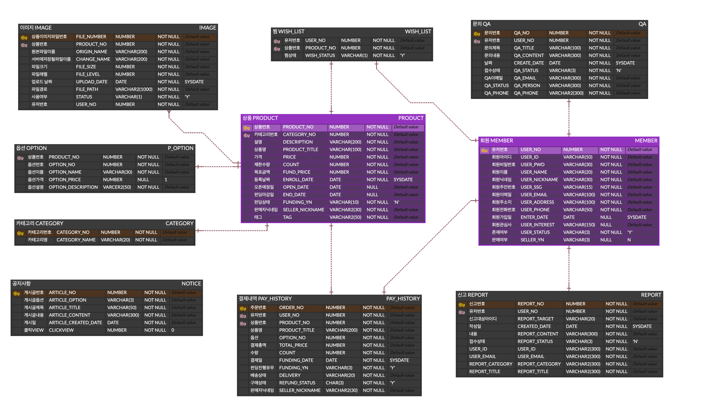
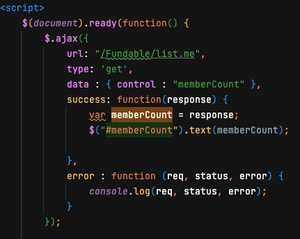
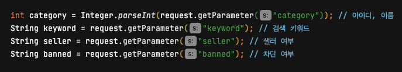
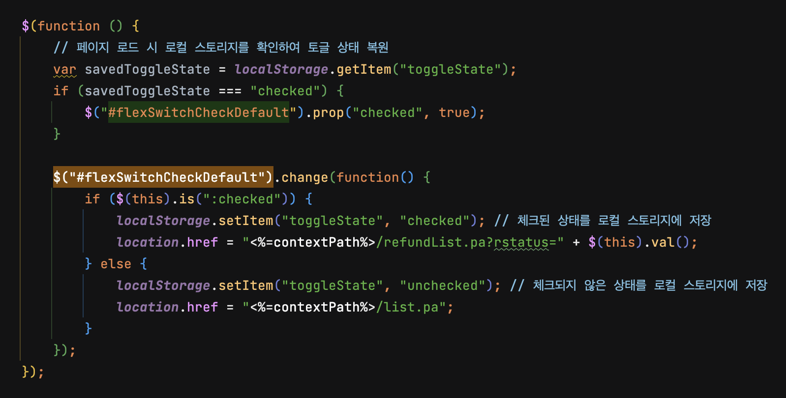

# SEMI PROJECT
 

 

## 이름 : FUNDABLE
## 설명 : 펀딩을 재밌게 할 수 있다는 (fun + fund + able) 의미를 가진 펀딩 사이트
## 기간 : 2023.06.20 ~ 2023.07.20
## 인원 : 5명(팀프로젝트)
## 역할 : 관리자 페이지 구현
  
## 개발 환경
### 언어 : JAVA11, HTML, CSS, Javascript
### 프레임워크 : MyBatis, Apache Tomcat9.0
### 라이브러리 : jQuery
### DB : Oracle DB
### 서버 : Apache Tomcat9.0
### IDE : IntelliJ
 

 

 

## ERD

view

 

 

 

## 소감
 

	<big>
		처음 해본 팀 프로젝트에서 작동하는 기능을 만들어 본 것이 거진 처음이였다.
    먼저 Tomcat서버를 통해 실제 작동하는 서버를 구동해 보았으며 MVC 패턴을 처음으로 쓰는데 복잡함이 앞섰지만 뒤로 갈수록 이해가 되서 수월했다.
    MVC 패턴을 통해 객체(Class)와 상속(Inheritance)을 이해하는데 도움이 되었으며, 데이터가 어떤 구조로 움직이는지 파악할 수 있었다.
    또한, DB에서 CRUD작업을 통해 데이터를 생성, 조회, 갱신, 삭제를 직접 해보는 것은 데이터베이스 실무 능력의 첫발을 딛게 할 수 있었다.
    무엇보다 협업이 중요한 과정에서 협업툴이 없었던 것은 꽤나 어려운 일이었지만 그만큼 많은 얘기를 나누어야 했고 덕분에 서로 많은 오류를 줄여나갈 수 있었다.
    개발 과정 중 첫 팀 프로젝트였지만 그만큼 프론트, 백엔드, DB까지 직접 작업해본것은 나에게 큰 의미가 될 것 같다.
	</big>

 

 

## 나의 역할
 

### 관리자 페이지 개설

- [관리자 메인페이지](#메인페이지)
- [회원정보관리](#회원정보관리)
- [펀딩신청관리](#펀딩신청관리)
- [상품관리](#상품관리)
- [결제관리](#결제관리)

 
 

### 메인페이지

 
view

 

  
 

 
description

  
 

  <ul>
   <li>
    

     
Ajax 비동기 통신으로 DashBoard에 정보 전달

     
    

   </li>
  </ul> 
 

 
 

### 회원정보관리

 
view

 

  
 

 
description

  
 

  <ul>
   <li>
    

     
키워드를 통한 검색

     
     
    

   </li>
   <li>
    

     
회원정보 모달

     
    

   </li>
  </ul> 
 

 
 

### 펀딩신청관리

 
view

 

  
 

 
description

  
 

  <ul>
   <li>
    

     
펀딩신청상품 모달

     
    

   </li>
  </ul> 
 

 
 

### 상품관리

 
view

 

  
 

 
description

  
 

  <ul>
   <li>
    

     
상품상세 확인 페이지

     
    

   </li>
  </ul> 
 

 
 

### 결제관리

 
view

 

  
 

 
description

  
 

  <ul>
   <li>
    

     
토글 스위치를 통한 환불 요청건 조회

     
    

   </li>
   <li>
    

     
페이지 로딩 시 토글 스위치 상태 유지 코드

     
    

   </li>
  </ul> 
 

